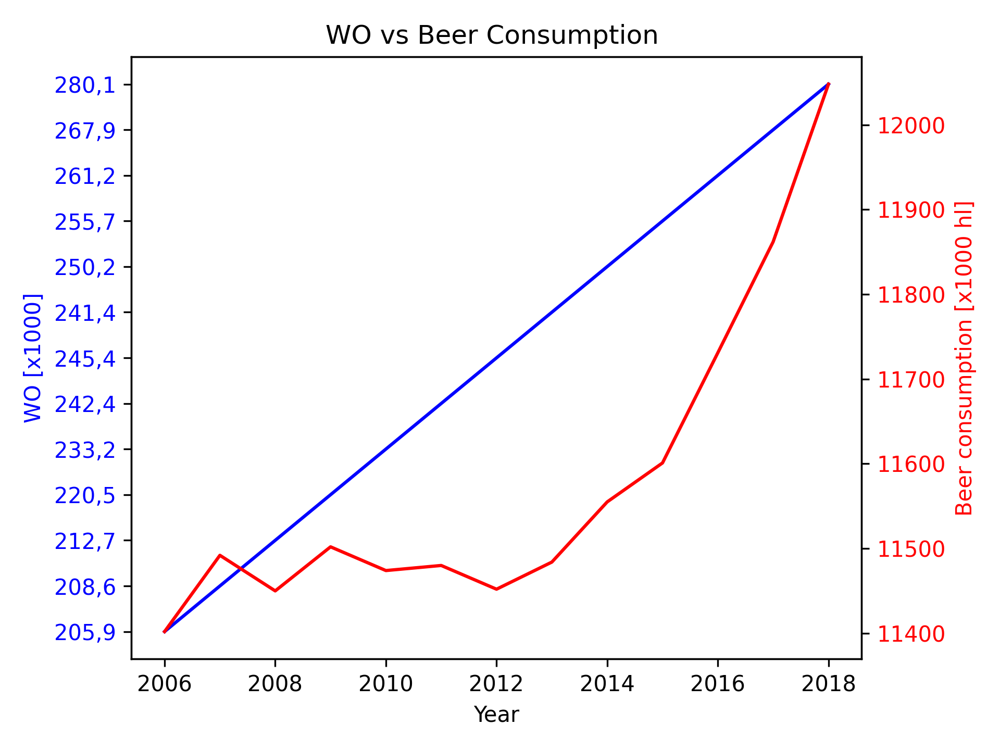

13981412

Fantastic yeasts and where to find them: the hidden diversity of dimorphic fungal pathogens — Marley C. Caballero Van Dyke et al., Curr Opin Microbiol, 2019

An analysis of the forces required to drag sheep over various surfaces

The neurocognitive effects of alcohol on adolescents and young adults

